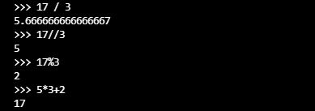

#Instalasi dan Penggunaan Interpreter Python

[[kembali](README.md)]

#BAB 1

Python 
Dapat menulis skrip shell Unix atau file batch Windows untuk beberapa tugas ini, tetapi skrip shell paling baik dalam memindahkan file dan mengubah data teks, tidak cocok untuk aplikasi atau game GUI.
Dapat menulis program C/C++/Java, tetapi membutuhkan banyak waktu pengembangan untuk mendapatkan program draf pertama.
Python lebih mudah digunakan, tersedia di sistem operasi Windows, macOS, dan Unix, dan akan membantu Anda menyelesaikan pekerjaan dengan lebih cepat.

Python mudah digunakan, tetapi merupakan bahasa pemrograman nyata, menawarkan lebih banyak struktur dan dukungan untuk program besar daripada yang dapat ditawarkan oleh skrip shell atau file batch. Di sisi lain, Python juga menawarkan lebih banyak pemeriksaan kesalahan daripada C, dan, sebagai bahasa tingkat sangat tinggi , ia memiliki tipe data tingkat tinggi bawaan, seperti array dan kamus fleksibel. 

Python memungkinkan program ditulis dengan ringkas dan mudah dibaca. Program yang ditulis dengan Python biasanya jauh lebih pendek daripada program C, C++, atau Java yang setara, karena beberapa alasan:

a. tipe data tingkat tinggi memungkinkan Anda untuk mengekspresikan operasi kompleks dalam satu pernyataan;
b. pengelompokan pernyataan dilakukan dengan indentasi alih-alih tanda kurung awal dan akhir;
c. tidak diperlukan deklarasi variabel atau argumen.

#BAB 2

Menggunakan Interpreter
untuk memulai python dengan 

Dalam mode ini ia meminta perintah berikutnya dengan prompt utama , biasanya tiga tanda lebih besar dari ( >>>); untuk baris lanjutan ia meminta dengan prompt sekunder , secara default tiga titik ( ...).

#BAB 3

Pengantar Python

Komentar dalam Python dimulai dengan karakter hash, #, dan diperpanjang hingga akhir baris fisik. 

KALKULATOR

Numeric
operator +,-,* dan /

Pembagian (/) selalu menghasilkan bilangan float
operator // menghasilkan bilangan integer (membuang hasil pecahan)
operator % menghitung sisa hasil bagi

Bilangan pangkat (**)

Variabel
Tanda sama dengan ( =) digunakan untuk memberikan nilai pada variabel. Jika suatu variabel tidak "didefinisikan" (diberi nilai), mencoba menggunakannya akan memberi Anda kesalahan

Operasi gabungan antara bilangan integer dan bilangan float

Dalam mode interaktif, ekspresi tercetak terakhir ditetapkan ke variabel _. 

STRING
 Python juga dapat memanipulasi string, yang dapat diekspresikan dalam beberapa cara. Mereka dapat diapit oleh tanda kutip tunggal ( '...') atau tanda kutip ganda ( "...") dengan hasil yang sama 
 