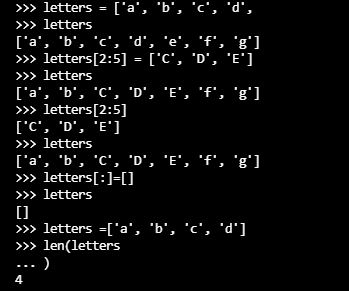
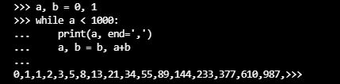

#Instalasi dan Penggunaan Interpreter Python

[[kembali](README.md)]

#BAB 1

Python 
Dapat menulis skrip shell Unix atau file batch Windows untuk beberapa tugas ini, tetapi skrip shell paling baik dalam memindahkan file dan mengubah data teks, tidak cocok untuk aplikasi atau game GUI.
Dapat menulis program C/C++/Java, tetapi membutuhkan banyak waktu pengembangan untuk mendapatkan program draf pertama.
Python lebih mudah digunakan, tersedia di sistem operasi Windows, macOS, dan Unix, dan akan membantu Anda menyelesaikan pekerjaan dengan lebih cepat.

Python mudah digunakan, tetapi merupakan bahasa pemrograman nyata, menawarkan lebih banyak struktur dan dukungan untuk program besar daripada yang dapat ditawarkan oleh skrip shell atau file batch. Di sisi lain, Python juga menawarkan lebih banyak pemeriksaan kesalahan daripada C, dan, sebagai bahasa tingkat sangat tinggi , ia memiliki tipe data tingkat tinggi bawaan, seperti array dan kamus fleksibel. 

Python memungkinkan program ditulis dengan ringkas dan mudah dibaca. Program yang ditulis dengan Python biasanya jauh lebih pendek daripada program C, C++, atau Java yang setara, karena beberapa alasan:

a. tipe data tingkat tinggi memungkinkan Anda untuk mengekspresikan operasi kompleks dalam satu pernyataan;
b. pengelompokan pernyataan dilakukan dengan indentasi alih-alih tanda kurung awal dan akhir;
c. tidak diperlukan deklarasi variabel atau argumen.

#BAB 2

Menggunakan Interpreter
untuk memulai python dengan 

Dalam mode ini ia meminta perintah berikutnya dengan prompt utama , biasanya tiga tanda lebih besar dari ( >>>); untuk baris lanjutan ia meminta dengan prompt sekunder , secara default tiga titik ( ...).

#BAB 3

Pengantar Python

Komentar dalam Python dimulai dengan karakter hash, #, dan diperpanjang hingga akhir baris fisik. 

KALKULATOR

Numeric
operator +,-,* dan /

Pembagian (/) selalu menghasilkan bilangan float
operator // menghasilkan bilangan integer (membuang hasil pecahan)
operator % menghitung sisa hasil bagi

Bilangan pangkat (**)

Variabel
Tanda sama dengan ( =) digunakan untuk memberikan nilai pada variabel. Jika suatu variabel tidak "didefinisikan" (diberi nilai), mencoba menggunakannya akan memberi Anda kesalahan

Operasi gabungan antara bilangan integer dan bilangan float

Dalam mode interaktif, ekspresi tercetak terakhir ditetapkan ke variabel _. 

STRING
Python juga dapat memanipulasi string, yang dapat diekspresikan dalam beberapa cara. Mereka dapat diapit oleh tanda kutip tunggal ( '...') atau tanda kutip ganda ( "...") dengan hasil yang sama 

Fungsi ini print()menghasilkan keluaran yang lebih mudah dibaca, dengan menghilangkan tanda kutip terlampir dan dengan mencetak karakter khusus dan karakter khusus

Jika tidak ingin karakter yang diawali dengan \ditafsirkan sebagai karakter khusus, Anda dapat menggunakan string mentah dengan menambahkan rsebelum kutipan pertama

String literal dapat menjangkau beberapa baris. Salah satu caranya adalah menggunakan tanda kutip tiga: """..."""atau '''...'''.

String dapat digabungkan (direkatkan) dengan +operator, dan diulang dengan *:

Dua atau lebih literal string (yaitu yang terlampir di antara tanda kutip) di samping satu sama lain secara otomatis digabungkan. Fitur ini sangat berguna ketika Anda ingin memutuskan senar yang panjang:

 berfungsi dengan dua literal, tidak dengan variabel atau ekspresi:

 menggabungkan variabel atau variabel dan literal, gunakan +:

String dapat diindeks, dengan karakter pertama memiliki indeks 0. Tidak ada tipe karakter terpisah; karakter hanyalah string ukuran satu. Indeks juga bisa berupa angka negatif, untuk mulai menghitung dari kanan. Selain pengindeksan, pengirisan juga didukung. Sementara pengindeksan digunakan untuk mendapatkan karakter individu, slicing memungkinkan Anda untuk mendapatkan substring

Indeks irisan memiliki default yang berguna; indeks pertama yang dihilangkan defaultnya adalah nol, indeks kedua yang dihilangkan defaultnya adalah ukuran string yang diiris.

Mencoba menggunakan indeks yang terlalu besar akan menghasilkan kesalahan. Namun, indeks irisan di luar jangkauan ditangani dengan anggun saat digunakan untuk mengiris.

String Python tidak dapat diubah — mereka tidak dapat diubah . Oleh karena itu, menetapkan ke posisi yang diindeks dalam string menghasilkan kesalahan. Jika Anda membutuhkan string yang berbeda harus membuat yang baru

Fungsi len()bawaan mengembalikan panjang string:

DAFTAR
Python mengetahui sejumlah tipe data gabungan , yang digunakan untuk mengelompokkan nilai-nilai lain. Yang paling serbaguna adalah list , yang dapat ditulis sebagai daftar nilai (item) yang dipisahkan koma di antara tanda kurung siku. Seperti string (dan semua jenis urutan bawaan lainnya), daftar dapat diindeks dan diiris. Semua operasi irisan mengembalikan daftar baru yang berisi elemen yang diminta. Ini berarti bahwa irisan berikut mengembalikan salinan daftar yang dangkal. Daftar juga mendukung operasi seperti penggabungan. 

Tidak seperti string, yang tidak dapat diubah , daftar adalah jenis yang dapat diubah , yaitu kontennya dapat diubah. juga dapat menambahkan item baru di akhir daftar, dengan menggunakan append().

Penetapan irisan juga dimungkinkan, dan ini bahkan dapat mengubah ukuran daftar atau menghapusnya seluruhnya.

Dimungkinkan untuk membuat daftar bersarang (membuat daftar yang berisi daftar lain), misalnya

menulis sub-urutan awal dari deret Fibonacci 

Fungsi print()menulis nilai argumen yang diberikan. Ini berbeda dari hanya menulis ekspresi yang ingin Anda tulis (seperti yang kita lakukan sebelumnya dalam contoh kalkulator) dalam cara menangani banyak argumen, jumlah floating point, dan string. String dicetak tanpa tanda kutip, dan spasi disisipkan di antara item, sehingga Anda dapat memformat sesuatu dengan baik, seperti ini

Argumen kata kunci end dapat digunakan untuk menghindari baris baru setelah output, atau mengakhiri output dengan string yang berbeda

