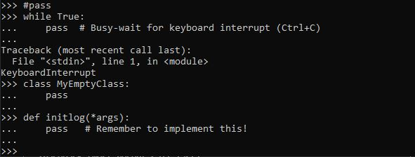
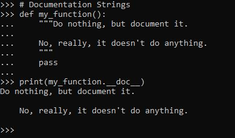

# PENGENDALI ALIRAN PROGRAM

[[kembali](README.md)]

# TUTORIAL BAB 4
Sumber : [tutorial python](https://docs.python.org/3.10/tutorial/controlflow.html)

file source code bab 4 : [minggu 2](src/minggu-2/)

**Macam-macam Control Flow**
Selain menggunakan pernyataan while yang sudah ada pada materi [minggu pertama](MINGGU-1.md) terdapat beberapa pernyataan control flow lainnya yang juga dikenal / digunakan pada bahasa pemrograman lainnya.

# 4.1 PERNYATAAN IF
Pernyataan IF digunakan untuk membandingkan nilai yang sama dengan beberapa konstanta atau memeriksa tipe / atribut tertentu.  Pada pernyataan *if* terdapat juga pernyataan *else* yang digunakan untuk mengeksekusi jika kondisi pada *if* bernilai **salah**. kemudian juga terdapat *else if* atau dapat disingkat *elif* untuk menyeleksi / membandingkan lagi jika terdapat lebih dari 1 kondisi. [Contoh program](src/minggu-2/if_statements.py)

# 4.2 PERNYATAAN FOR
Pernyataan for dalam Python sedikit berbeda dari apa yang  digunakan dalam C atau Pascal. Daripada selalu mengulangi perkembangan aritmatika angka (seperti dalam Pascal), atau memberi pengguna kemampuan untuk menentukan langkah iterasi dan kondisi penghentian (seperti C),pernyataan for pada Python mengulangi item dari urutan apa pun (daftar atau a string), dalam urutan yang muncul dalam urutan. Misalnya (tidak ada permainan kata-kata). [contoh program](src/minggu-2/for.py)

Code yang memodifikasi saat melakukan perulangan yang sama bisa jadi sulit untuk diperbaiki. Sebagai gantinya, biasanya lebih mudah untuk mengulang salinan koleksi atau membuat koleksi baru

# 4.3 FUNGSI range()
Fungsi *range()* digunakan untuk mengulangi urutan angka. [contoh program](src/minggu-2/range.py)

Perintah fungsi *range()* terdapat 3 parameter yaitu *(nilai_awal, nilai_akhir, perubahan nilai)*. parameter perubahan nilai jika tidak dicantumkan maka default akan bertambah 1. Perubahan nilai tidak selalu positif, dapat juga negatif / pengurangan nilai (descending). 

Fungsi *range()* juga dapat untuk perulangan index urutan dengan menggabungkan fungsi *len()*.

Perintah *range()* sebenarnya hanya menampilkan / mengembalikan item berurutan dari urutan yang diinginkan ketika perulangan. Untuk mendapatkan jumlah nilai pada urutan dapat dengan menggabungkan fungsi *sum()*.

# 4.4 Break dan Continue
Perintah **break** digunakan untuk menghentikan proses perulangan yang sedah berjalan.  [contoh program](src/minggu-2/break_continue.py)

contoh break untuk menghentikan perulangan for

Perintah **continue** mirip seperti perintah **break**, hanya saja jika dalam perintah break perulangan langsung berhenti, untuk perintah **continue** perulangan hanya melewati 1 kali proses iterasi saja. 

# 4.5 PERNYATAAN PASS
Pernyataan **pass** tidak melakukan apa-apa. Ini dapat digunakan ketika pernyataan diperlukan secara sintaksis tetapi program tidak memerlukan tindakan. Sebagai [contoh program](src/minggu-2/4.5_pass.py)

# 4.6 PERNYATAAN MATCH
Pernyataan **match** mengambil ekspresi dan membandingkan nilainya dengan pola berurutan yang diberikan sebagai satu atau lebih blok kasus. [contoh program](src/minggu-2/match.py)
Bentuk paling sederhana membandingkan nilai subjek terhadap satu atau lebih literal

pola juga dapat menggunakan konstanta bernama:

# 4.7 Defining Functions
membuat fungsi untuk menampilkan deret fibonacci : [contoh program](src/minggu-2/fungsi.py)

 Interpreter mengenali objek yang ditunjuk dengan nama itu sebagai fungsi yang ditentukan pengguna. Nama lain juga dapat menunjuk ke objek fungsi yang sama dan juga dapat digunakan untuk mengakses fungsi:

Pernyataan *return* kembali dengan nilai dari suatu fungsi. returntanpa argumen ekspresi kembali None. Jatuh dari akhir fungsi juga kembali None. Pernyataan tersebut *result.append(a)*memanggil metode dari objek daftar result. 

# 4.8 More on Defining Functions
Terdapat 3 bentuk  yang  dapat menggabungkan fungsi dengan sejumlah variabel argumen

## 4.8.1 Argumen nilai default
bentuk untuk menentukan nilai default untuk satu / lebih dokumen [contoh program](src/minggu-2/default.py)

Nilai default dievaluasi pada titik definisi fungsi dalam ruang lingkup yang ditentukan, sehingga

fungsi berikut mengakumulasikan argumen yang diteruskan ke fungsi tersebut pada panggilan berikutnya:

## 4.8.2 KEYWORD
Fungsi juga dapat dipanggil menggunakan argumen kata kunci dari formulir kwarg=value. Misalnya, fungsi berikut: [contoh program](src/minggu-2/keyword.py)

Dalam panggilan fungsi, argumen kata kunci harus mengikuti argumen posisi. Semua argumen kata kunci yang diteruskan harus cocok dengan salah satu argumen yang diterima oleh fungsi  

Ketika parameter formal terakhir dari formulir **name** ada, ia menerima kamus yang berisi semua argumen kata kunci kecuali yang terkait dengan parameter formal. Ini dapat digabungkan dengan parameter formal dari formulir *name* yang menerima tupel yang berisi argumen posisi di luar daftar parameter formal. 

kata kunci yang dicetak cocok dengan urutan yang disediakan dalam pemanggilan fungsi.

## 4.8.3 Parameter
Secara default, argumen dapat diteruskan ke fungsi Python baik dengan posisi atau secara eksplisit dengan kata kunci. Untuk keterbacaan dan kinerja, masuk akal untuk membatasi cara argumen dapat diteruskan sehingga pengembang hanya perlu melihat definisi fungsi untuk menentukan apakah item dilewatkan berdasarkan posisi, posisi atau kata kunci, atau kata kunci.

definisi fungsi :
*def f(pos1, pos2, /, pos_or_kwd, , kwd1, kwd2)*:
*pos1, pos2,* <- positional only
*pos_or_kwd,* <- positional or keyword
*kwd1, kwd2* <- keyword only
 
[contoh program](src/minggu-2/contoh_fungsi.py)

Perhatikan contoh definisi fungsi berikut dengan memperhatikan penanda /:

*  fungsi pertama, standard_arg, bentuk yang paling dikenal, tidak membatasi konvensi pemanggilan dan argumen dapat diteruskan oleh posisi atau kata kunci
* Fungsi kedua pos_only_argdibatasi hanya menggunakan parameter posisi karena ada /dalam definisi fungsi
* Fungsi ketiga kwd_only_argshanya mengizinkan argumen kata kunci seperti yang ditunjukkan oleh a dalam definisi fungsi
* ketiga pemanggilan fungsi tersebut dapat digunakan bersamaan

## 4.8.4 Arbitrary Argument Lists
menentukan bahwa suatu fungsi dapat dipanggil dengan sejumlah argumen yang berubah-ubah. Argumen-argumen ini akan dibungkus dalam sebuah tuple. Sebelum jumlah variabel argumen, nol atau lebih argumen normal dapat terjadi.

## 4.8.5 Unpacking Argument Lists
fungsi range() bawaan mengharapkan argumen mulai dan berhenti yang terpisah. Jika tidak tersedia secara terpisah, tulis pemanggilan fungsi dengan -operator untuk membongkar argumen dari daftar atau tupel:

## 4.8.6. Lambda Expression
Fungsi anonim kecil dapat dibuat dengan lambda expression. Fungsi ini mengembalikan jumlah dari dua argumennya: . Fungsi Lambda dapat digunakan di mana pun objek fungsi diperlukan. 

## 4.8.7. Documentation Strings
Berikut adalah beberapa konvensi tentang konten dan pemformatan string dokumentasi.

Baris pertama harus selalu merupakan ringkasan singkat dan ringkas dari tujuan objek. Untuk singkatnya, itu tidak boleh secara eksplisit menyatakan nama atau jenis objek, karena ini tersedia dengan cara lain (kecuali jika nama itu merupakan kata kerja yang menggambarkan operasi suatu fungsi). Baris ini harus dimulai dengan huruf kapital dan diakhiri dengan titik.

Jika ada lebih banyak baris dalam string dokumentasi, baris kedua harus kosong, yang secara visual memisahkan ringkasan dari deskripsi lainnya. Baris berikut harus berupa satu atau lebih paragraf yang menjelaskan konvensi pemanggilan objek, efek sampingnya, dll.

## 4.8.8. Function Annotations
Anotasi fungsi sepenuhnya merupakan informasi metadata opsional tentang jenis yang digunakan oleh fungsi yang ditentukan pengguna.
Anotasi disimpan dalam__annotations__ atribut fungsi sebagai kamus dan tidak berpengaruh pada bagian lain dari fungsi tersebut. Anotasi parameter ditentukan oleh titik dua setelah nama parameter, diikuti dengan ekspresi yang mengevaluasi nilai anotasi. Anotasi pengembalian ditentukan oleh literal->, diikuti oleh ekspresi, antara daftar parameter dan titik dua yang menunjukkan akhirdefpernyataan.

# 4.9 Intermezzo: Coding Style
* Gunakan lekukan 4 spasi, dan tanpa tab. 4 spasi adalah kompromi yang baik antara lekukan kecil (memungkinkan kedalaman sarang yang lebih besar) dan lekukan besar (lebih mudah dibaca). Tab menimbulkan kebingungan, dan sebaiknya ditinggalkan.
* Bungkus garis sehingga tidak melebihi 79 karakter. Ini membantu pengguna dengan layar kecil dan memungkinkan untuk memiliki beberapa file kode secara berdampingan pada layar yang lebih besar.
* Gunakan baris kosong untuk memisahkan fungsi dan kelas, dan blok kode yang lebih besar di dalam fungsi.
* Jika memungkinkan, berikan komentar pada baris mereka sendiri.
* Gunakan docstrings.
* Gunakan spasi di sekitar operator dan setelah koma, tetapi tidak langsung di dalam konstruksi tanda kurung: .a = f(1, 2) + g(3, 4)
* Beri nama kelas dan fungsi Anda secara konsisten; konvensi adalah untuk digunakan UpperCamelCaseuntuk kelas dan lowercase_with_underscoresuntuk fungsi dan metode. Selalu gunakan selfsebagai nama untuk argumen metode pertama (lihat Pandangan Pertama pada Kelas untuk mengetahui lebih lanjut tentang kelas dan metode).
* Jangan gunakan penyandian mewah jika kode Anda dimaksudkan untuk digunakan di lingkungan internasional. Default Python, UTF-8, atau bahkan ASCII biasa bekerja paling baik dalam hal apa pun.
* Demikian juga, jangan gunakan karakter non-ASCII dalam pengidentifikasi jika hanya ada sedikit kemungkinan orang yang berbicara bahasa yang berbeda akan membaca atau mempertahankan kode.